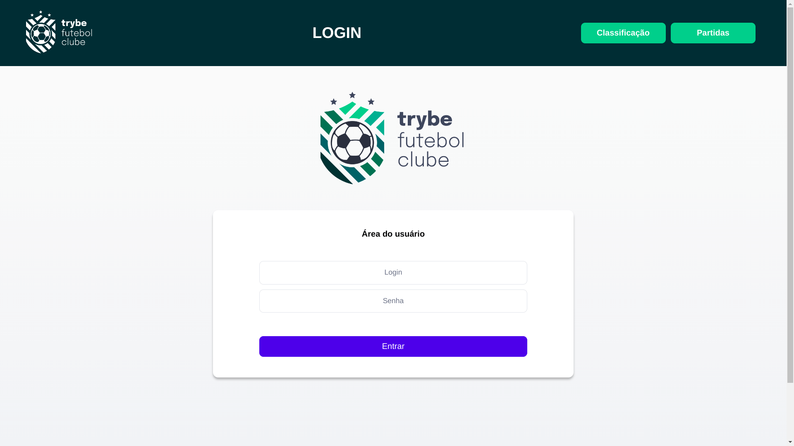
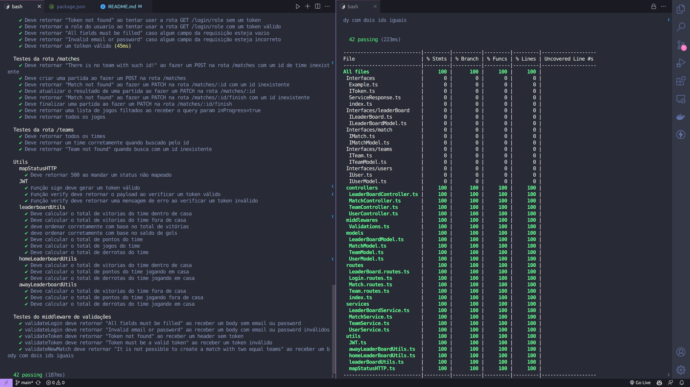
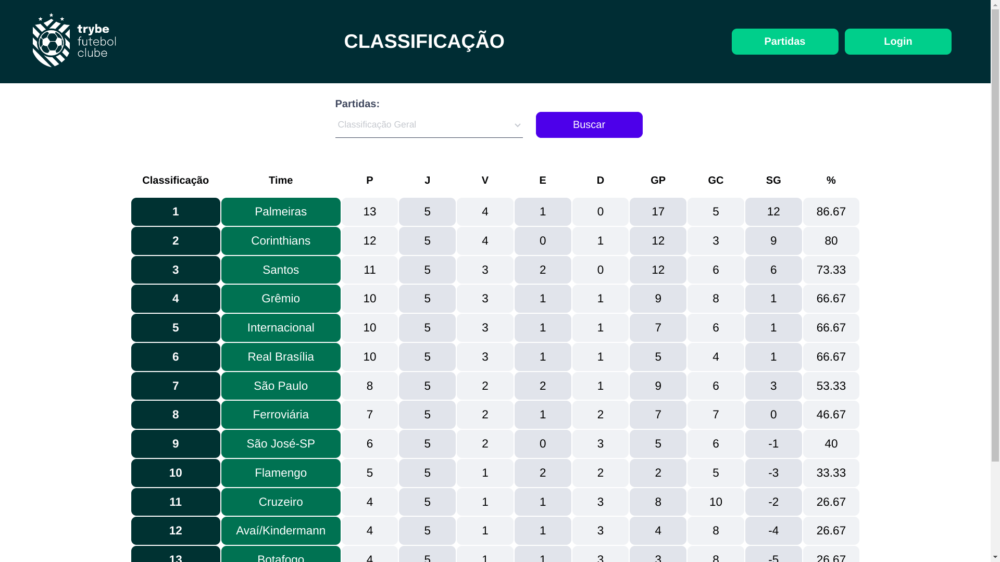
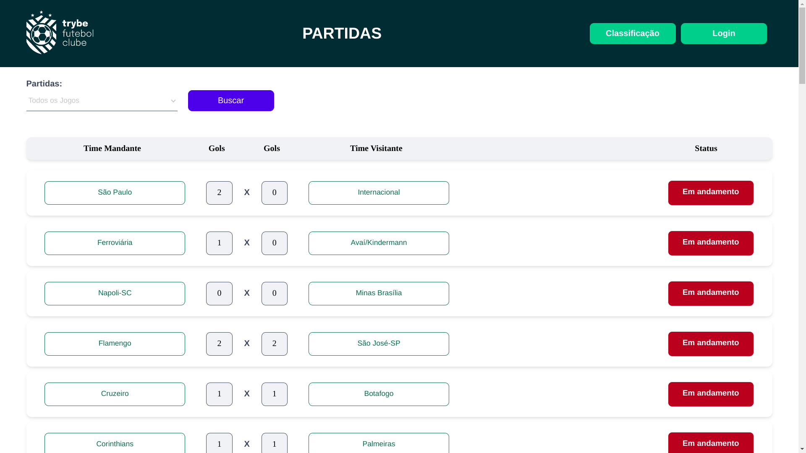
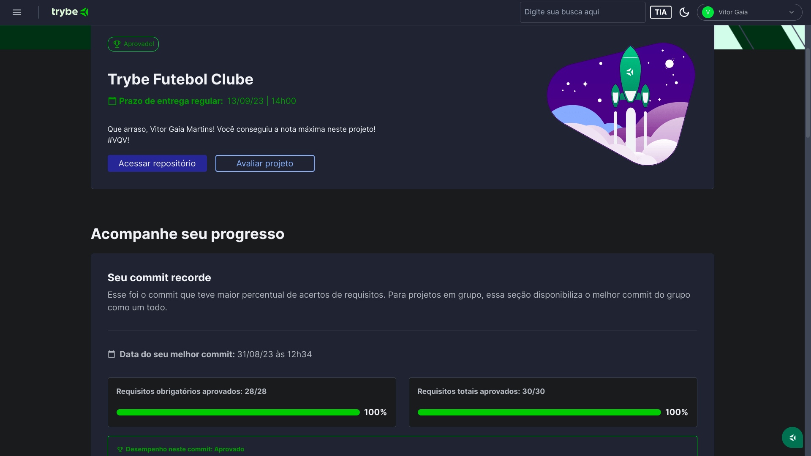

# ⚽ Trybe Futebol Clube
<div align="center">
  
</div>

## 📘 Sobre
Site informativo dedicado a fornecer atualizações sobre partidas e classificações de futebol. Através da implementação de uma API, adotei a abordagem TDD para testes e integrei todas as partes do projeto via docker-compose. Essa integração possibilitou a interação das aplicações com um banco de dados MySQL de forma fluida e eficiente.

## 🛠️ Ferramentas
- Typescript
- Sequelize
- Node.js
- MySQL
- Programação orientada a objetos e Princípios SOLID
- JWT
- Docker
- Mocha, Chai e Sinon

## 📝 Pré Requisitos
Antes de começar, você vai precisar ter instalado em sua máquina as seguintes ferramentas:
[Git](https://git-scm.com), [Node.js](https://nodejs.org/en/) e [Docker](https://www.docker.com/) versão 2.5 ou superior.  
Além disto é bom ter um editor para trabalhar com o código como [VSCode](https://code.visualstudio.com/);

## 🎮 Como executar
```bash
# Clone este repositório
$ git clone git@github.com:vitorGaia/trybe-futebol-clube.git

# Instale as dependências
$ npm run install:apps

# Suba os containers
$ npm run compose:up

# Acesse o frontend da aplicação
$ http://localhost:3000/
```

## 🧪 Testes
<div align="center">
  
</div>

## 🖼️ Imagens
<div align="center">
  
</div>
  
<details>
  <summary style="font-size: 22px;"> Ver mais imagens ⬇️ </summary>
  <div align="center">
    
  </div>
  
  <div align="center">
    
  </div>

  <div align="center">
    
  </div>

  <div align="center">
    
  </div>
</details>